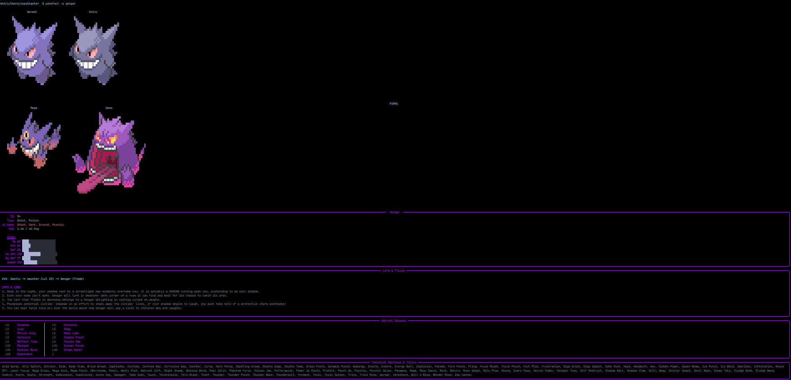

# 🐉 pokefact

> terminal pokedex. because opening a browser breaks my immersion.



i wrote this at 3am because i needed to check garchomp's speed stat without leaving neovim. it fetches data from pokeapi, grabs ascii art from a local database, and prints it all pretty-like using `rich`.

it fits your rice. it handles tokyo night/catppuccin colors automatically. it plays audio cries if you have `mpv`.

## ✨ stuff it does

- **art:** shows normal, shiny, and mega forms. ascii only.
- **math:** calculates x4 and x2 weaknesses because i can't remember type charts.
- **lore:** pulls random dex entries and anime trivia (yes, it knows about ash-greninja).
- **moves:** dumps the natural moveset and tms. huge list.
- **lazy:** install script does everything. i hate dependency hell.

## 📦 you need these

- **linux** or **macos** (windows users: use wsl or go away or wait for an update)
- **python 3.10+**
- **mpv** (optional, for audio cries)
- **nerd fonts** (if you want icons to work)

## 💾 install

just copy paste this. it creates a venv so it doesn't break your system python.

```
git clone https://github.com/potatopakoda/pokefact.git &&
cd pokefact && 
chmod +x install.sh &&
./install.sh
```

🎮 usage
get a random mon because you're bored:

```
pokefact
```

look up specific stuff:

```
pokefact -p gengar
```

shiny mode + audio (loud):

```
pokefact -p lucario -s -a
```

🗑️ uninstall
if you hate it:

```
./uninstall.sh
```


🧠 credits
data: pokeapi

art: pokemon-colorscripts (bundled locally)

terminal pretty print: rich


mit license. steal this code if you want, i don't care.


[UPDATE!!!!!!]

for windows users, there's a .ps1 file. Steps to install :
1. open powershell
2. make sure you have git installed
3. Run
```
git clone https://github.com/potatopakoda/pokefact.git
```

```
cd pokefact
```

```
chmod +x install.sh
```

```
.\install.ps1
```

4. close window and open a new one.
5. Ta-Daaa!!


***NOTE***
audio may not work on windows, idk why though i didn't bother. so...yeahh :)


